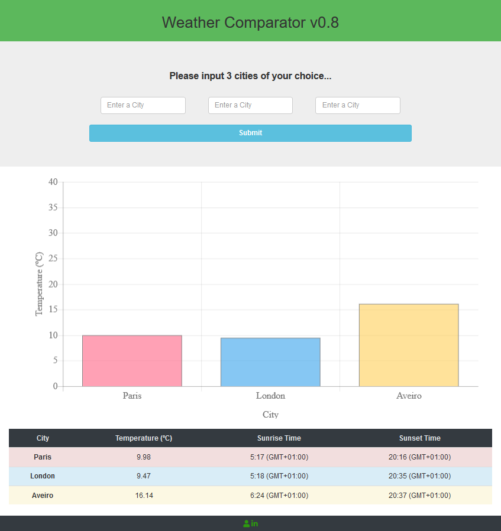

# Weather Comparator

This repository contains a webpage based in nodeJS, wich allows the user to introduce 3 city names and compare some related data, namely, the current weather, sunrise time and sunset time.
This was my first nodeJS application and all the data is requested from https://openweathermap.org/, by means of an internal API. The view engine used is EJS.

### Frameworks used:
1. Express - mostly for routing;
2. body-barser - for parasing JSON requests;
3. winston - to make a log record of the requests;
4. async - to make multiple assynchronous requests;
5. Charts.js - to make the bar chart;
6. In order to make the table sortable, i used a library that you can find [here](https://www.kryogenix.org/code/browser/sorttable/).

### How to use the application:
1. Clone the repository to your machine;
2. Open comand prompt and navigate to the folder;
3. Type "node server.js" and press enter;
4. The app will listen on Port 3000 (make sure you have it avaliable);
5. Open browser and go to "localhost:3000";
6. Type the 3 cities you want and submit the request.

 <figcaption> 
Fig. 1 - Preview of the WEB app 
</figcaption>
 

